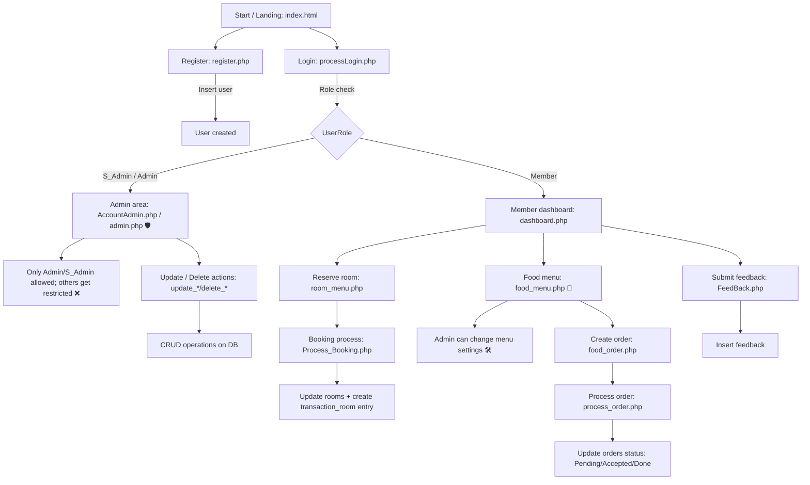

# Casa Italiana (Hotel & Restaurant) — PHP + MySQL

**Project made in April 2024.**

A small web application (PHP + MySQL) for managing a combined **hotel + restaurant** experience:
- User registration & login (with role-based redirects)
- Room reservation/booking (updates `rooms`, creates entries in `transaction_room`)
- Restaurant ordering (browsing `recipes` and placing `orders`)
- Submitting customer feedback

Database schema is provided in `files/casa_italiana.sql`.

---

## Tech Stack
- **Frontend:** plain HTML/CSS/JS
- **Backend:** PHP (mysqli + prepared statements in some places)
- **Database:** MySQL / MariaDB
- **Auth:** role-based redirects (see `processLogin.php`)

---

## Project Structure (high level)
- `index.html` — landing + login form
- `register.php` — registration form + inserts into `User_tbl`
- `processLogin.php` — checks credentials + redirects by role
- `dashboard.php` — main user dashboard
- `room_menu.php`, `Process_Booking.php` — room reservation flow
- `food_menu.php`, `food_order.php`, `process_order.php` — ordering flow
- `FeedBack.php` — feedback submission
- Admin/updates pages:
  - `admin.php`, `AccountAdmin.php`
  - `update_*` and `delete_*` scripts
- `conn.php` — database connection
- `img/` — images used by the UI
- `files/casa_italiana.sql` — full DB dump

---

Database Setup
### 1) Create the database
In phpMyAdmin (or MySQL CLI), create a database named:
- **`casa_italiana`**

> The dump was generated in **April 2024** (see header in `files/casa_italiana.sql`).

### 2) Import schema + seed data
Import `files/casa_italiana.sql`.

This dump creates these main tables (among others):
- `user_tbl` (users)
- `rooms` (room availability + occupant)
- `transaction_room` (room bookings)
- `recipes` (menu items)
- `orders` (food orders)
- `feedback` (user feedback)

> Note: The dump includes stored function + triggers for sanitizing `<script>` tags on `user_tbl` inserts/updates.

---

## Configure MySQL credentials (`conn.php`)
Edit `conn.php`:
- `$server`
- `$username`
- `$password`
- `$database` (should be `casa_italiana`)

---

## Run the project locally
1. Put this folder under your web server root, for example in **Apache**:
   - `htdocs/Fcasa_italiana`
2. Ensure PHP is enabled.
3. Start Apache (and MySQL/MariaDB).
4. Open:
   - `http://localhost/Fcasa_italiana/index.html`

---

## Authentication & Roles
Login is handled by `processLogin.php`.
- It queries `User_tbl` by `U_email` and compares `U_Pass`.
- After successful login, it redirects based on `UserRole`:
  - `S_Admin` → `AccountAdmin.php`
  - `Admin` → `admin.php`
  - `Member` → `dashboard.php`

---

## Key Database Tables (quick reference)
### `user_tbl`
Fields include:
- `UID` (PK)
- `U_email` (unique)
- `U_Pass`
- `Fname`, `Lname`, `Address`, `Nationality`, `Occupation`
- `Gender`, `UserRole`

### `rooms`
- `RoomID` (PK)
- `RoomFlr`
- `Availability` (`Occupied`, `Available`, `Reserved`)
- `OccupiedBy_UID` / `OccupiedBy_email` (FKs to `user_tbl`)

### `transaction_room`
- Booking/transaction records for reserved/occupied rooms

### `recipes` and `orders`
- `recipes` contains menu items (name, image, type, price, availability, rating)
- `orders` stores quantity, per-item price, totals, status (`Pending`, `Done`, `Accepted`)

---

## Default Data
The SQL dump includes sample rows for recipes, rooms, users, and some orders/feedback.

---

## Notes / Known Limitations (from current codebase)
- Passwords appear to be stored **in plain text** in the provided dump and are compared directly.
- Security is mixed: prepared statements are used in several places, but overall app hardening (hashing, CSRF tokens, etc.) is not included.

---

## Flowchart: Main App Workflows (Hotel + Restaurant) 🤵‍♂️🏨🍝

---

## Screens / Workflows (what to try) ✅
- Register a new user via `register.php` ✍️
- Login from `index.html` 🔑
- Reserve a room (see `room_menu.php` → `Process_Booking.php`) 🛏️
- Order food from the menu (see `food_menu.php` → ordering scripts) 🍕🥗
- Submit feedback (see `FeedBack.php`) 💬⭐

---

## Database File 🗄️
- Primary reference: `files/casa_italiana.sql`

