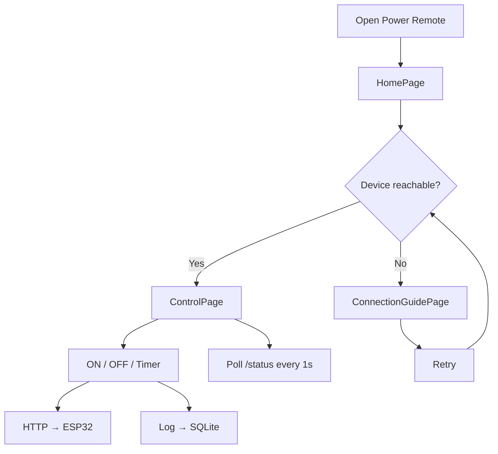
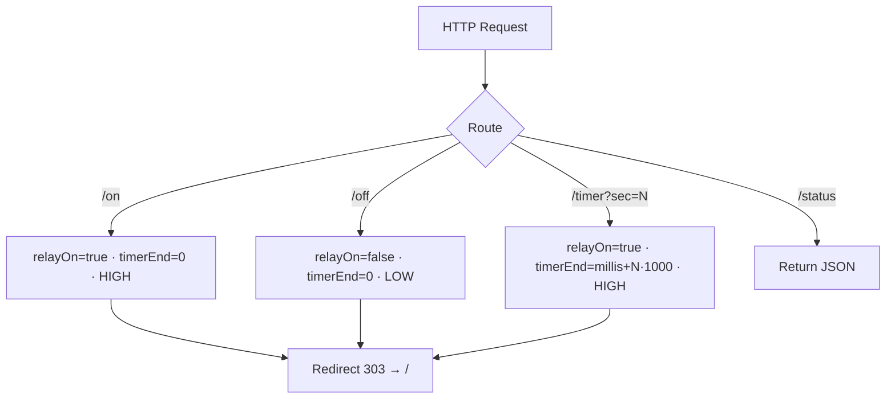
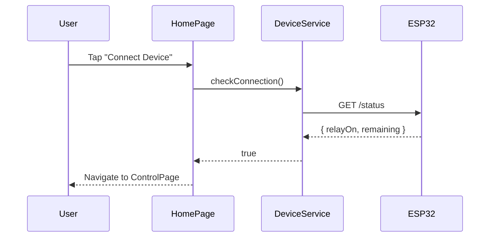
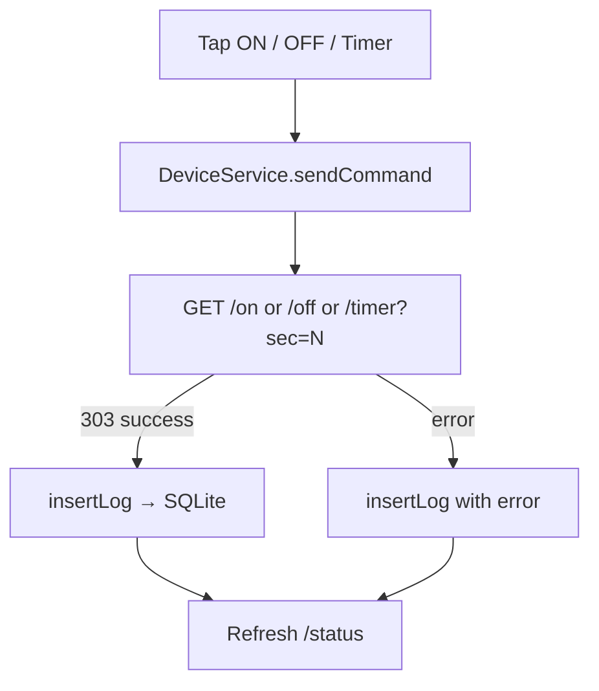

# ⚡ Power Remote

> A Flutter app for controlling an ESP32-based relay over Wi-Fi — turn lights on/off, set timers, and track activity from your phone.

---

## What it does

Connect your phone to the ESP32's Wi-Fi access point and get a clean control interface for your relay. No internet required — everything runs locally over the ESP32's own hotspot.

| Feature | Details |
|---|---|
| 🔌 Relay control | Turn ON / OFF instantly via HTTP |
| ⏱️ Timer presets | 30s · 1m · 5m · 10m · 30m · 1h |
| 🕐 Custom timer | Set seconds, minutes, hours — or a specific clock time |
| 📡 Live polling | Syncs relay state + remaining time every second |
| 📋 Activity log | Every command saved locally with timestamp + status |
| ⚙️ Settings | Switch between test server and ESP32, clear logs |

---

## How it works

```
Open App → Connect to ESP32 AP → Control relay → Commands logged to SQLite
```



---

## App screens

### Home
Tap **Connect Device** — the app hits `/status` on the ESP32. If reachable, you go straight to Control. If not, you get a step-by-step connection guide.

### Control
Your main panel. Shows live relay state, remaining countdown, and all your timer options.

### Connection Guide
Walks you through: enable Wi-Fi → connect to `LightTimerESP` → return to app → retry.

### Logs
Full history of every command sent — action, duration, timestamp, success or error.

### Settings
- Swap base URL between test server and live ESP32
- Clear all stored logs

---

## Project structure

```
power_remote/
├── esp32code.ino              # ESP32 firmware (flash this first)
├── pubspec.yaml
└── lib/
    ├── main.dart              # App entry point
    ├── models/
    │   └── log_model.dart     # LogEntry (SQLite row)
    ├── pages/
    │   ├── home_page.dart           # Connect + QR code
    │   ├── control_page.dart        # Relay control + status polling
    │   ├── logs_page.dart           # Activity history
    │   ├── settings_page.dart       # URL + preferences + clear logs
    │   └── connection_guide_page.dart
    ├── services/
    │   ├── device_service.dart      # HTTP: /status /on /off /timer
    │   ├── network_scanner.dart     # Android Wi-Fi scan + connect
    │   ├── settings_service.dart    # shared_preferences wrapper
    │   └── database_service.dart   # sqflite wrapper
    └── widgets/
        ├── electric_button.dart
        ├── neumorphic_container.dart
        └── connection_indicator.dart
```

---

## ESP32 endpoints

The companion firmware (`esp32code.ino`) runs a Wi-Fi access point and HTTP server.

| Endpoint | What it does |
|---|---|
| `GET /` | Web UI with live JS countdown |
| `GET /on` | Relay ON (redirects to `/`) |
| `GET /off` | Relay OFF (redirects to `/`) |
| `GET /timer?sec=N` | Relay ON for N seconds |
| `GET /status` | Returns `{ relayOn: bool, remaining: int }` |



---

## Data flow

### Connection check



### Sending a command



---

## Getting started

### 1 — Flash the ESP32

Open `esp32code.ino` in the Arduino IDE and flash it. Make sure these match:

```
SSID:     LightTimerESP
Password: 12345678
```

### 2 — Install Flutter dependencies

```bash
flutter pub get
```

### 3 — Run on device

```bash
flutter run
```

> **Android is recommended** — Wi-Fi scan and auto-connect features use Android-specific APIs.

---

## Requirements

- **Flutter SDK** `>=3.9.2`
- **Android** (for full Wi-Fi scan/connect support)

**Key packages**

| Category | Package |
|---|---|
| HTTP | `http`, `connectivity_plus` |
| Wi-Fi | `wifi_scan`, `wifi_iot`, `permission_handler` |
| Storage | `sqflite`, `path`, `shared_preferences` |
| UI | `qr_flutter`, `lottie`, `app_settings` |

---

## Notes

- All logs are stored **locally only** — no remote analytics.
- The app targets a **single ESP32** device. Multi-device support can be added via `SettingsService` + extended connection UI.
- Connection is verified by reaching the `/status` endpoint — no ping, no assumptions.