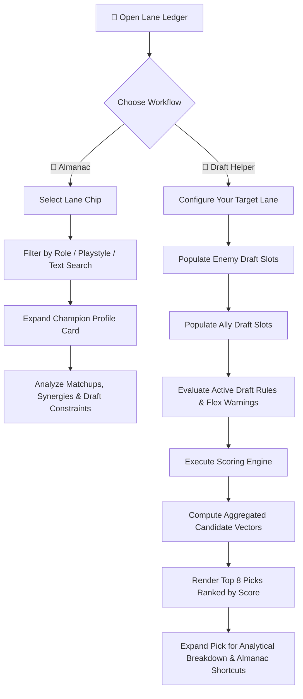

# 🎮 Lane Ledger (Lane Matchup Assistant)

**Lane Ledger** is a lightning-fast, data-driven Wild Rift draft companion designed to help you make optimized picking decisions during champion select. It started by optimizing the **Dragon Lane** (ADC/APC) and now supports all **5 roles** (Dragon/Support/Mid/Jungle/Baron).

Browse the **Almanac** to study matchups or feed live draft data into the **Draft Helper** to receive ranked, contextual champion recommendations complete with synergy breakdowns and hazard warnings.

🚀 **Live Deployment:** [lane-matchup-assistant.vercel.app](https://lane-matchup-assistant.vercel.app/)

---

## ✨ Features & Architecture

| Module | Purpose | Key Attributes |
| :--- | :--- | :--- |
| 📖 **Almanac** | Browse champion identities, lane matchups, active synergies, and playstyle taxonomy. | Fast filtering by role tags, lane chips, and fuzzy text search. |
| 🎯 **Draft Helper** | Live draft evaluator. Input ally/enemy picks to reveal optimal lane choices. | Generates real-time threat warnings, flex-pick detection, and ranked scoring. |

### System Scope

* **Primary Lanes:** 🐉 Dragon (ADC/APC) · 🛡️ Support · 🔮 Mid · 🌲 Jungle · ⛰️ Baron
* **Performance:** Sub-millisecond scoring calculation execution via client-side compilation.
* **State Persistence:** Local storage retention caches active draft rooms against sudden browser refreshes.

---

## 🗺️ Application Architecture Flow



---

## 🧠 Scoring Engine Mechanics

The recommendation engine parses candidate pools dynamically based on your active draft array:

1. **Direct Lane Vectoring:** Aggregates explicit direct counters vs. the designated lane opponent.
2. **Reverse Lane Countering:** Factors in whether the opponent natively mitigates your champion's win conditions.
3. **Draft Synergy Coefficients:** Calculates network values between the candidate pick and locked-in ally champions.
4. **Compositional Thresholds:** Evaluates structural team requirements (e.g., AP/AD balancing, lack of crowd control, frontline tank requirements).
5. **Conditional Exclusions:** Drops scores or flags warnings if heavy hard-counters are drafting into open pools.

---

## 🏗️ Data Architecture & Build Pipeline

Champion datasets are strictly modularized to avoid monolithic corruption. The app reads from a compiled output generated by a preprocessing pipeline step.

```text
src/
├── data/                    <-- ✏️ EDIT SOURCE FILES HERE
│   ├── drLane.json          # Dragon Lane (ADC/APC core datasets)
│   ├── suppRole.json        # Support synergies and archetypes
│   ├── Midlane.json         # Mid lane profiles
│   ├── JglRole.json         # Jungle paths/threat vectors
│   ├── BrLane.json          # Baron lane configurations
│   ├── draftRules.json      # Compositional constraints & conditional logic
│   └── otherinfo.json       # Meta metadata mappings
└── public/
    └── dataset.json         <-- ⚠️ AUTO-GENERATED (Do not touch)
```

To modify or append champion information, **only modify JSON files within `src/data/**`**, then rebuild the distribution bundle.

---

## 🚀 Development Quick Start

### Prerequisites

* Node.js v18 or later
* npm / pnpm / yarn

### Installation & Execution

```bash
# Install dependencies
npm install

# Compile datasets and boot local Vite environment
npm run build:data && npm run dev
```

The application will default to running on `http://localhost:5173`.

### Build & Deploy

```bash
# Production optimization compilation
npm run build

# Validate production build locally
npm run preview
```

The compilation sequence generates outputs directly into `/dist`, optimized for seamless Vercel edge deployments.

---

## 🛠️ Technology Stack

* **UI Engine:** React 19 (leveraging React Compiler optimizations)
* **Build System:** Vite 8
* **State & Engine:** Native JS Context / Client-side JSON Scoring Framework
* **Storage Layer:** Browser `localStorage` API for session caching

---

## 📝 Roadmap & Future Outlook

* Transition static pipeline data into automated upstream patches matching current Wild Rift balances.
* Community draft telemetry integrations.
* Enhanced pick-and-ban recommendation rules for specific team archetypes (e.g., Poke, Dive, Scale comps).

---

## 📄 License

This project is open-source and available under the [MIT License](https://www.google.com/search?q=LICENSE).

