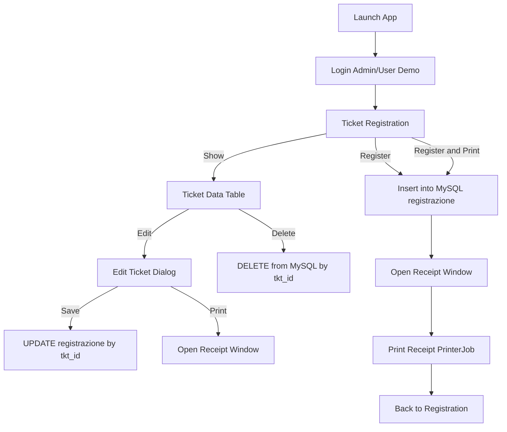

---

# PrType_mvi (Movie Ticketing System)

A Java Swing desktop application developed for registering movie tickets, managing ticket records via a **MySQL** database, handling CRUD operations, and generating printable formatted ticket receipts.

---

## 🧭 High-Level Flowchart



---

## 📑 Project Overview

This application provides a streamlined desktop workflow for movie ticket management:

1. **Authentication:** Access via hardcoded demo accounts.
2. **Ticket Registration:**
* Input fields for customer name, movie title, base price, seat number, and ticket priority.
* Real-time persistence to the local database.
* Optional instant generation of a printable ticket receipt.


3. **Data Management Display:**
* Populates active records from the database into a unified `JTable`.
* Supports row-by-row **Edit** and **Delete** actions.
* Displays real-time financial tracking (sum of ticket prices + total record count).


4. **Ticket Modification:**
* Interactive dialog to update ticket metadata, pushing live `UPDATE` requests back to MySQL.


5. **Hardware Printing Integration:**
* Computes applied discounts (based on passenger/visitor categories) and tax rates (11% VAT).
* Uses Java’s native `PrinterJob` API to format and print the specific `JPanel` container layout.


---

## 📂 System Architecture & Main Classes

### 1. `src/App.java` (Application Entry)

* Initializes the application lifecycle and renders the login window.
* **Demo Credentials:**
* `admin` / `admin`
* `user` / `user`


* Routes authorized sessions directly to `Tickteting_main`.

### 2. `src/Tickteting_main.java` (Registration Core)

* The primary UI frame hosting the input form layout.
* Handles data binding for customer names, movie titles, prices, seats, and customer categories (*Regular, VIP, Student, Senior, PWD, Child*).
* Executes secure database insertion using parameterized `PreparedStatement` queries.

### 3. `src/DataDisplay.java` (`JDialog`)

* Renders records fetched from the MySQL `registrazione` table.
* Features control mechanisms to trigger deletions or open the edit context.

### 4. `src/modifica.java` (`JDialog`)

* Handles record modifications, allowing changes to existing entries and updating the database state via conditional queries (`WHERE tkt_id = ?`).

### 5. `src/printa.java` (`JFrame`)

* Formats the visual receipt layout (branding, ticket metadata, and timestamping).
* **Pricing Logic Rules:**
* **VIP:** Applies a 30% discount.
* **Student / Senior / PWD / Child:** Applies a 15% discount (pricing multiplier set to `0.85`).
* **Regular:** Standard base pricing.
* *Final formula includes a flat 11% VAT calculated on top of the discounted rate.*


---

## 🗄️ Database Schema (MySQL)

The system targets a local database instance named **`tiketa`** using the schema outlined below:

### Table: `registrazione`

| Column Name | Data Type | Key / Attribute | Description |
| --- | --- | --- | --- |
| **`tkt_id`** | `INT` | `PRIMARY KEY`, `AUTO_INCREMENT` | Unique identifier for each ticket |
| **`C_nme`** | `VARCHAR` |  | Customer Name |
| **`movie`** | `VARCHAR` |  | Movie Title |
| **`prc`** | `DOUBLE` / `DECIMAL` |  | Base Ticket Price |
| **`seat`** | `VARCHAR` |  | Seat Number Allocation |
| **`prty`** | `VARCHAR` |  | Ticket Priority Group / Category |
| **`RegDateTime`** | `DATETIME` |  | System Generated Timestamp |

---

## 🛠️ Installation & Setup

### 1. Prerequisites

* **Java Development Kit (JDK)** installed on your machine.
* **MySQL Server** running locally.
* A Java-supported IDE (such as IntelliJ IDEA, Eclipse, or VS Code).

### 2. Database Initialization

1. Start your local MySQL service.
2. Create a database named `tiketa`.
3. Execute the schema generation script found in the root file: `sql code 2 .txt`.

### 3. Connection Configuration

The JDBC connection properties are hardcoded directly within the source components. Ensure your local environment aligns with the defaults below, or update the strings across the `.java` source files manually:

* **URL:** `jdbc:mysql://localhost:3306/tiketa`
* **User:** `root`
* **Password:** `""` *(empty string)*

### 4. Build and Execution

* Compile and execute `src/App.java` to launch the program.

---

## ⚠️ Legacy Quirks & Refactoring Notes

* **Connection Clashes:** `Tickteting_main.java` contains legacy connection string references pointing to an external `busticketing` schema in certain segments. Ensure all connection variables are standardized to `tiketa` during initialization.
* **State Syncing:** Some UI windows instantiate independently; refreshing the main table display might require closing and reopen actions depending on the explicit dialog focus lifecycle.

---

## 🗺️ Project Map

```
├── src/
│   ├── App.java              # Application main entry point & login frame
│   ├── Tickteting_main.java  # Core ticket registration panel 
│   ├── DataDisplay.java      # Data grid viewer for CRUD management
│   ├── modifica.java         # Data update wizard dialog
│   ├── printa.java           # Receipt rendering engine & print layout
│   ├── ConsolePrinter.java   # Utility print example (Independent code)
│   └── PdfDocument.java      # Layout template placeholder
└── sql code 2 .txt           # Database schema implementation scripts

```

---

## 🚀 Repository Details

* **Suggested Name:** `ticketa-ticketing-system`
* **Repository Tagline:**

> "A Java Swing and MySQL-backed movie ticketing desktop application featuring CRUD operations, automated tax/discount pricing engines, and physical receipt printing configurations."

---

Looking solid, bruv. Let me know if you want to fix those hardcoded database URLs next!